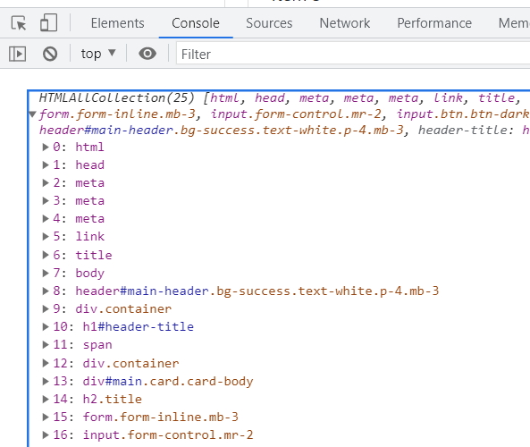

# JavaScript DOM Crash Course

## Using the console

To see the complete Document Object Model (DOM)

```
    console.dir(document);
```

This will show a list of all nodes in the DOM.

We can look at parts of the DOM.

```
    console.log(document.domain);
```

Returns.

> 127.0.0.1

```
    console.log(document.URL);
```

Returns.

> http://127.0.0.1:5500/index.html


```
    console.log(document.title);
```

Returns.

> Item Lister

You can also change content in the DOM.

```
    document.title = 123;
```

Changes the documents title to **123**.

```
    console.log(document.head);
```

Gets the header part of the document.

```
    console.log(document.all);
```



**document-all** is really interesting. It gets a complete list of all nodes in the document and numbers each node from 0 which is the HTML node.

You can't rely on the node numbering because if you add an element to the document it will renumber the document.

### Using node numbering

```
    console.log(document.all[10]);
```

will return Node number 11 and in our case this is.

> h1#header-title

Once again we can change this element.

```
    document.all[10].textContent = 'Hello';
```

This changes the header title to **Hello**.


You can have multiple forms on a page. To get to a particular form.

```
    console.log(document.forms[0]);
```

Will bring up the first form on the page.

Get a list of links on your form.

```
    console.log(document.links);
```

This will bring back a HTML collection of links on the page.

Similar to this you can get a list of images on a page.

```
    console.log(document.images);
```

Once again this is a HTML collection so if you want to iterate through the images you will have to turn the collection into an array.

```
    const images = document.images;

    Array.from(images).forEach((image) => {
        console.log(image.src);
    });
```

Returns.

> http://127.0.0.1:5500/assets/images/dom/about.jpg     
> http://127.0.0.1:5500/assets/images/dom/add-book.jpg      
> http://127.0.0.1:5500/assets/images/dom/append-content.jpg        
> http://127.0.0.1:5500/assets/images/dom/console-styles.jpg        
> http://127.0.0.1:5500/assets/images/dom/contact.jpg       
> http://127.0.0.1:5500/assets/images/dom/hide-checkbox.jpg     
> http://127.0.0.1:5500/assets/images/dom/innerHTML.jpg


## Get elements by ID

Allows you to select elements by their ID.

```
    console.log(document.getElementById('header-title'));
```

Returns the element with an ID of *header-title*.

```
    var headerTitle = document.getElementById('header-title');
    console.log(headerTitle.textContent);
    console.log(headerTitle.innerHTML);
```

Returns.

> Item Lister 123       
> Item Lister &lt;span style=&quot;display:none&quot;&gt;123&lt;/span&gt;

You can modify the title.

```
    // getElementById
    console.log(document.getElementById('header-title'));
    var headerTitle = document.getElementById('header-title');
    var header = document.getElementById('main-header');
    headerTitle.textContent = 'Hello';
    headerTitle.innerText = 'Goodbye';
    console.log(headerTitle.innerText);
    headerTitle.innerHTML = '<h3>Hello</h3>';
    header.style.borderBottom = 'solid 3px #000';
```


Change the text with *headerTitle.textContent*.

Change the HTML with *headerTitle.innerHTML*.

## Get elements by class name

```
    var items = document.getElementsByClassName('list-group-item');
    console.log(items);
```

Returns.

> HTMLCollection(4) [li.list-group-item, li.list-group-item, li.list-group-item, li.list-group-item]

Once again this is a HTML collection so you if you need to iterate you have to change the collection into an array.

```
    Array.from(items).forEach((item) => {
        console.log(item.innerText);
    });
```

Returns.

> Item 1        
> Item 2        
> Item 3        
> Item 4

You can select a particular item in the collection.

```
    var items = document.getElementsByClassName('list-group-item');

    console.log(items[1]);
```

Returns.

> &lt;li class=&quot;list-group-item&quot;&gt;Item 2&lt;/li&gt;

Or change the text.

```
    var items = document.getElementsByClassName('list-group-item');

    items[1].textContent = 'Hello 2';
```


You can also change CSS styles.

```
    var items = document.getElementsByClassName('list-group-item');
    items[1].textContent = 'Hello 2';
    items[1].style.fontWeight = 'bold';
    items[1].style.backgroundColor = 'yellow';
```


If you wanted to change style for each element in the list the following code won't work.

```
    var items = document.getElementsByClassName('list-group-item');

    // Gives error
    items.style.backgroundColor = '#f4f4f4';
```

You have to iterate through the collection.

```
    var items = document.getElementsByClassName('list-group-item');

    for (var i = 0; i < items.length; i++) {
        items[i].style.backgroundColor = '#f4f4f4';
    }
```


## Get elements by tag name

```
    var li = document.getElementsByTagName('li');
    console.log(li);
    console.log(li[1]);
```

Returns.

> HTMLCollection(4) [li.list-group-item, li.list-group-item, li.list-group-item, li.list-group-item]        
> li.list-group-item

The first console line brings back a HTML collection of four elements.

The next console line gets the second item in the collection.

## Query selector

We can also get a single item by using the ``querySelector()`` function.

```
    var header = document.querySelector('#main-header');
    header.style.borderBottom = 'solid 4px red';
```


We can also change text after we have selected an element.

```
    var input = document.querySelector('input');
    input.value = 'Hello World'
```


You can also change the button text whit a query selector.

```
    var submit = document.querySelector('input[type="submit"]');
    submit.value="SEND"
```


The ``.querySelector()`` function only works on one element at a time. We can show this with the following code.

```
    var item = document.querySelector('.list-group-item');
    item.style.color = 'red';
```

Only changes the first item in the item collection.


To change the last item in the list use the last-child selector.

```
    var lastItem = document.querySelector('.list-group-item:last-child');
    lastItem.style.color = 'blue';
```


You can also use the nth-child() selector to select a particular element in a list.

```
    var secondItem = document.querySelector('.list-group-item:nth-child(2)');
    secondItem.style.color = 'coral';
```


**Note:** this seems to work on a 1 based system not a zero based system.

## querySelectorAll()

If you want to select all elements in a collection use the ``querySelectorAll()`` function.

```
    var titles = document.querySelectorAll('.title');

    console.log(titles);
    titles[0].textContent = 'Hello';
    titles[1].textContent = 'World';
```

Returns.

> NodeList(2) [h2.title, h2.title]


### iterate through all selected elements

```
    let items = document.querySelectorAll('li');

    console.log(items);

    items.forEach((item) => {
        console.log(item.innerText);
    });
```

> NodeList(4) [li.list-group-item, li.list-group-item, li.list-group-item, li.list-group-item]      
> Item 1       
> Item 2       
> Item 3       
> Item 4

As the selected elements are in a node list we don't have to use Array.from() to change the elements into an array.

Another way of iterating through elements is to use a ``for`` loop. The following code will add a background colour to each item element. This is handy bit of code to add alternating colours to grid rows.

```
    var odd = document.querySelectorAll('li:nth-child(odd)');
    var even = document.querySelectorAll('li:nth-child(even)');

    for (var i = 0; i < odd.length; i++) {
        odd[i].style.backgroundColor = '#f4f4f4';
        even[i].style.backgroundColor = '#ccc';
    }
```


## Traversing the DOM

Now we are going to look at parent nodes, child nodes and siblings.

```
    var itemList = document.querySelector('#items');

    // parentNode
    console.log(itemList.parentNode);
```

Returns.

> &lt;div id=&quot;main&quot; class=&quot;card card-body&quot;&gt;      
>    &lt;h2 class=&quot;title&quot;&gt;Add Items&lt;/h2&gt;     
>    &lt;form class=&quot;form-inline mb-3&quot;&gt;        
>      &lt;input type=&quot;text&quot; class=&quot;form-control mr-2&quot;&gt;      
>      &lt;input type=&quot;submit&quot; class=&quot;btn btn-dark&quot; value=&quot;> ubmit&quot;&gt;       
>    &lt;/form&gt;      
>    &lt;h2 class=&quot;title&quot;&gt;Items&lt;/h2&gt;     
>    &lt;ul id=&quot;items&quot; class=&quot;list-group&quot;&gt;       
>      &lt;li class=&quot;list-group-item&quot;&gt;Item 1&lt;/li&gt;        
>      &lt;li class=&quot;list-group-item&quot;&gt;Item 2&lt;/li&gt;        
>      &lt;li class=&quot;list-group-item&quot;&gt;Item 3&lt;/li&gt;        
>      &lt;li class=&quot;list-group-item&quot;&gt;Item 4&lt;/li&gt;        
>    &lt;/ul&gt;        
>   &lt;/div&gt;

On the code above the ``h2`` element has a parent element which is the ``div`` with *id="main"*. 

That is the ``h2`` element is **inside** the parent div.

The ``h2`` element is a child of the div.

The *form* is a sibling of the ``h2`` element.

```
    itemList.parentNode.style.backgroundColor = '#f4f4f4';
```

Changes the background colour of the parent node.


You can see the changes in the parent div.

> &lt;div id=&quot;main&quot; class=&quot;card card-body&quot; style=&quot;background-color: rgb(244, 244, 244);&quot;&gt;...&lt;/div&gt;

If we want to see what the parent node of the parent node is we can use the following code.

```
    console.log(itemList.parentNode.parentNode);
```

Returns.

> &lt;div class=&quot;container&quot;&gt;...&lt;/div&gt;

```
    console.log(itemList.parentNode.parentNode.parentNode);
```

Returns.

> &lt;body&gt;...&lt;/body&gt;

**parentElement** is basically the same thing.

```
    var itemList = document.querySelector('#items');

    console.log(itemList.parentElement);
```

Returns.

> div#main.card.card-body

### Child nodes

The child nodes of the element with the ID #items will bring back the ``li's`` and white space nodes.

```
    var itemList = document.querySelector('#items');

    // childNodes
    console.log(itemList.childNodes);
```

Returns.

> NodeList(9) [text, li.list-group-item, text, li.list-group-item, text, li.> list-group-item, text, li.list-group-item, text]      
> 0: text       
> 1: li.list-group-item     
> 2: text       
> 3: li.list-group-item     
> 4: text       
> 5: li.list-group-item     
> 6: text       
> 7: li.list-group-item     
> 8: text       
> length: 9

The whitespace nodes in the child nodes are for example, *2: text*. These are just the newlines at the end of the ``li`` elements.

If you got rid of the line breaks you would just end up with the ``li`` nodes in the list.

This is a problem with ``.childNodes`` so instead it is better to use ``.children``.

```
    console.log(itemList.children);
```

Returns.

> HTMLCollection(4) [li.list-group-item, li.list-group-item, li.list-group-item, li.list-group-item]
> 0: li.list-group-item
> 1: li.list-group-item
> 2: li.list-group-item
> 3: li.list-group-item
> length: 4

Now we are getting the children which is what we want. This time it is a HTML collection so we need to change it to an array if we want to iterate through it.

we can select an individual item from the list using bracket notation.

```
    console.log(itemList.children[1]);
```

Returns the second item in the collection.

> li.list-group-item

You can open the item a scroll through its attributes. The outerHTML can be examined.

> outerHTML: "<li class=\"list-group-item\">Item 2</li>"

You can use this to change the HTML.

```
    itemList.children[1].style.backgroundColor = 'yellow';
```

Returns.


There is also a property named ``.firstChild``.

```
    console.log(itemList.firstChild);
```

Returns.

> #text

Once again this includes white space and doesn't bring back what we were expecting so instead use ``.firstElementChild``.

```
    console.log(itemList.firstElementChild);
```

This time it returns something useful.

> li.list-group-item

Scroll through the attributes to find the *outerText*.

> outerText: "Item 1"

We also have ``.lastChild`` and ``.lastElementChild``.

```
    // lastChild
    console.log(itemList.lastChild);
    // lastElementChild
    console.log(itemList.lastElementChild);
    itemList.lastElementChild.textContent = 'Hello 4';
```

Returns.

> #text     
> li.list-group-item

OuterHTML.

> outerHTML: "<li class=\"list-group-item\">Hello 4</li>"


### Siblings

#### .nextSibling

```
    console.log(itemList.nextSibling);
```

Once again this returns the whitespace so use ``.nextElementSibling`` instead.

```
    console.log(itemList.nextElementSibling);
```

Returns.

> null

This is because there are no "next" siblings in *itemList*.

#### .previousSibling and .previousElementSibling

```
// previousSibling
console.log(itemList.previousSibling);
// previousElementSibling
console.log(itemList.previousElementSibling);
itemList.previousElementSibling.style.color = 'green';
```

Returns.

> #text     
> h2.title


### Creating DOM elements

```
    var newDiv = document.createElement('div');
    console.log(newDiv);
```

Returns

> div

The outerHTML attribute is an empty div.

> <div></div>

We can add other elements or styles to this div.

```
    newDiv.className = 'hello';
    console.log(newDiv);
```

Returns.

> div.hello

outerHTML.

> outerHTML: "<div class=\"hello\"></div>"

We can add an ID.

```
    newDiv.id = 'hello1';
```

outerHTML.

> outerHTML: "<div class=\"hello\" id=\"hello1\"></div>"

Add an attribute.

```
    newDiv.setAttribute('title', 'Hello Div');
```

outerHTML.

> outerHTML: "<div class=\"hello\" id=\"hello1\" title=\"Hello Div\"></div>"

#### .createTextNode

We can create a new text node for our div.

```
    let newDivText = document.createTextNode('Hello World');
```

Now, we have to append this text node as a child to our div.

```
    newDiv.appendChild(newDivText);
```

Returns.

> <div class="hello" id="hello1" title="Hello Div">Hello World</div>

At the moment the div exists but it has to be inserted into the DOM.

We will append it to our container div and insert it before our **H1** element.

```
    let container = document.querySelector('header .container');
    let h1 = document.querySelector('header h1');

    newDiv.style.fontSize = '30px';

    container.insertBefore(newDiv, h1);

    console.log(newDiv);
```

Returns.

> div#hello1.hello

outerHTML.

> outerHTML: "<div class=\"hello\" id=\"hello1\" title=\"Hello Div\" style=\"font-size: 30px;\">Hello World</div>"


## Events

Add a new button to the HTML.

```
    ...
    </ul>
    <br/>
    <button class="btn btn-dark btn-block" id="button">Click here</button>
```

One way of creating an event.

```
    const button = document.getElementById('button').addEventListener('click', () => {
      console.log('Button clicked!');
    });
```

A nicer way is to create a separate event listener.

```
    const button = document.getElementById('button').addEventListener('click', buttonClick);

    const buttonClick(e) => {
      console.log('Button clicked!');
    }
```

You will get an error with this code. buttonClick is called before initialisation.

**Note:** If you use ``var`` instead of ``let`` or ``const`` it will actually work this way.

To fix this.

```
    const buttonClick = (e) => {
      console.log('Button clicked!');
    }

    const button = document.getElementById('button').addEventListener('click', buttonClick);
```

We can also change elements like we did previously.

```
    const buttonClick = (e) => {
      document.getElementById('header-title').textContent = 'Changed';
    }

    const button = document.getElementById('button').addEventListener('click', buttonClick);
```


You could also use ``.querySelector()`` to change the background colour of the panel.

```
    const buttonClick = (e) => {
      document.getElementById('header-title').textContent = 'Changed';
      document.querySelector('#main').style.backgroundColor = '#f4f4f4';
    }

    const button = document.getElementById('button').addEventListener('click', buttonClick);
```

We are passing in the event to our function as **e**. We can log this.

```
    const buttonClick = (e) => {
      console.log(e);
    }

    const button = document.getElementById('button').addEventListener('click', buttonClick);
````

This returns information about our event.

> PointerEvent {isTrusted: true, pointerId: 1, width: 1, height: 1, pressure: 0, …}

If you use the following code you will see the element that was clicked.

```
    console.log(e.target);
```

Returns.

> <button class="btn btn-dark btn-block" id="button">Click here</button>


If we want the ID of the element we can get it with.

```
    console.log(e.target.id);
```

Returns.

> button

```
    console.log(e.target.className);
```

Returns all of the classes on the element.

> btn btn-dark btn-block

```
    console.log(e.target.classList);
```

Returns a DOM token list of classes.

> DOMTokenList(3) ["btn", "btn-dark", "btn-block", value: "btn btn-dark btn-block"]     
> 0: "btn"      
> 1: "btn-dark"     
> 2: "btn-block"        
> length: 3     
> value: "btn btn-dark btn-block"       
> [[Prototype]]: DOMTokenList


Now we can output these results to the DOM.

Add a div to the HTML.

```
    ...
    </ul>
    <div id="output"></div>
    <br/>
    ...
```

Now add this code.

```
    const buttonClick = (e) => {
      let output = document.getElementById('output');
      output.innerHTML = '<h3>' + e.target.id + '</h3>';
    }
```

Added element to the DOM.


You can find the type of event that has been triggered.

```
    console.log(e.type);
```

Returns.

> click

You can check if a certain key has been pressed and run code based on that key.

```
    console.log(e.altKey);
```

Now, if I click on the button the ``e.altKey`` will return.

> false

If I hold the ``Alt`` key down while I click the button it will return.

> true

I could now write code based on what key I held down.

I can also change the type of key pressed.

```
    console.log(e.altKey);
    console.log(e.ctrlKey);
    console.log(e.shiftKey);

      if (e.ctrlKey) {
        console.log('You pressed the control key!');
      }
```

When I hold the ``Ctrl`` key down.

> false     
> true      
> false     
> You pressed the control key!

### Event types

Create a function.

```
    const button = document.getElementById('button');
    button.addEventListener('click', runEvent);

    function runEvent(e) {
      e.preventDefault();
      console.log('EVENT TYPE: ' + e.type);
    }
```

> EVENT TYPE: click

Now, change the click type.

```
        button.addEventListener('dblclick', runEvent);
```

If I double click the mouse.

> EVENT TYPE: dblclick

```
    button.addEventListener('mousedown', runEvent);
```

Returns.

> EVENT TYPE: mousedown

```
    button.addEventListener('mouseup', runEvent);
```

I have to click and hold the mouse down then release and it returns.

> EVENT TYPE: mouseup

Now we are going to test other event type. First we'll add a new ``div`` to our page.

```
    <button class="btn btn-dark btn-block" id="button">Click here</button><br/>
    <div id-"box" style="width:400px;height:200px;background-color:#f4f4f4;"></div>
```

In our JavaScript add.

```
    const box = document.getElementById('box');
    box.addEventListener('mouseenter', runEvent);
```

Now as soon as I hover over the box it will run the function ``runEvent()``.

> EVENT TYPE: mouseenter

You also have.

```
    const box = document.getElementById('box');
    box.addEventListener('mouseenter', runEvent);
    box.addEventListener('mouseleave', runEvent);
```

When you go in and out of the box.

> EVENT TYPE: mouseenter        
> EVENT TYPE: mouseleave

You also have.

```
    const box = document.getElementById('box');
    box.addEventListener('mouseover', runEvent);
    box.addEventListener('mouseout', runEvent);
```

Returns.

> EVENT TYPE: mouseover     
> EVENT TYPE: mouseout

Our next event is ``mousemove``.

```
    const box = document.getElementById('box');
    box.addEventListener('mousemove', runEvent);

    //button.addEventListener('mousedown', runEvent);
    function runEvent(e) {
      e.preventDefault();
      console.log('EVENT TYPE: ' + e.type);

      output.innerHTML = '<h3>MouseX: ' + e.offsetX + ' </h3><h3>MouseY: ' + e.offsetY + '</h3>';
      document.body.style.backgroundColor = "rgb(" + e.offsetX + "," + e.offsetY + ", 40)";
    }
```

When we run this code we see the X and Y mouse values change and the border colour change as we move the mouse around.


.


We could remove the ``document.body`` line and replace it with. This will change the box element's colour as we move around.

```
      box.style.backgroundColor = "rgb(" + e.offsetX + "," + e.offsetY + ", 40)";
```


### Keyboard and Input events

Lets create ``keydown`` event in the input box with a type of *text*. 

```
    var itemInput = document.querySelector('input[type="text"]');
    var form = document.querySelector('form');

    itemInput.addEventListener('keydown', runEvent);

    function runEvent(e) {
      e.preventDefault();
      console.log('EVENT TYPE: ' + e.type);
    }
```

When we type text in the input field we kick off the following event.

> EVENT TYPE: keydown

Each letter we type will fire off the ``keydown`` event.

```
    var itemInput = document.querySelector('input[type="text"]');
    var form = document.querySelector('form');

    itemInput.addEventListener('keydown', runEvent);

    function runEvent(e) {
      console.log('EVENT TYPE: ' + e.type);

      document.getElementById('output').innerHTML = '<h3>' + e.target.value + '</h3>';
    }
```

Returns.


If we add a ``keyup`` event we can even make sure that the final character is shown in the output. By typing in the same text as previously we can see the following in the log.

> EVENT TYPE: keydown
> EVENT TYPE: keyup

You also have a ``keypress`` event.

```
    itemInput.addEventListener('keypress', runEvent);
```

We can set the focus of our input field.

```
    itemInput.addEventListener('focus', runEvent);
```

We can set focus and blur at the same time. When we click into the input field we will see the cursor and when we click out the cursor will disappear.

```
    var itemInput = document.querySelector('input[type="text"]');

    itemInput.addEventListener('focus', runEvent);
    itemInput.addEventListener('blur', runEvent);
```

Returns.

> EVENT TYPE: focus     
> EVENT TYPE: blur

There are two other events ``cut`` and ``paste``.

```
    var itemInput = document.querySelector('input[type="text"]');

    itemInput.addEventListener('cut', runEvent);
    itemInput.addEventListener('paste', runEvent);
```

You can cut the text in the input field and it fires this event.

> EVENT TYPE: cut

If you paste it back the following event occurs.

> EVENT TYPE: paste

There is also an ``input`` event.

```
    itemInput.addEventListener('input', runEvent);
```

If you do anything in the input field it will send off this message.

> EVENT TYPE: input

Let's add a select item after our input text field.

```
    <input type="text" class="form-control mr-2">
    <select class="form-control mr2">
      <option value="1">1</option>
      <option value="2">2</option>
      <option value="3">3</option>
    </select>
```

We want an event that fires when we change a value.

```
let select = document.querySelector('select');

select.addEventListener('change', runEvent);

function runEvent(e) {
  console.log('EVENT TYPE: ' + e.type);
  console.log(e.target.value);
}
```

When we change a value in our dropdown list it returns.


> EVENT TYPE: change        
> 3


Now we will check events on the ``submit`` button.

```
    let form = document.querySelector('form');

    form.addEventListener('submit', runEvent);

    function runEvent(e) {
      console.log('EVENT TYPE: ' + e.type);
      console.log(e.target.value);
    }
```

You will see the results appear then disappear on the screen.

To stop this from happening change the ``runEvent()`` function.

```
    function runEvent(e) {
      e.preventDefault();
      console.log('EVENT TYPE: ' + e.type);
      console.log(e.target.value);
    }
```

Now the page won't refresh and this is the result.

> EVENT TYPE: change        
> 3


## Adding events to a form

Now we are going to build a working application with a modified version of the form.

First we select all of the elements that we want to work with and then create event listeners for them.

```
    var form = document.getElementById('addForm');
    var itemList = document.getElementById('items');
    var filter = document.getElementById('filter');

    // Form submit event
    form.addEventListener('submit', addItem);
    // Delete event
    itemList.addEventListener('click', removeItem);
    // Filter event
    filter.addEventListener('keyup', filterItems);
```

Now, we need to create functions for our event handling starting with ``addItem``.

#### addItem()

```
    function addItem(e) {
      e.preventDefault();

      // Get input value
      var newItem = document.getElementById('item').value;

      // Create new li element
      var li = document.createElement('li');
      // Add class
      li.className = 'list-group-item';
      // Add text node with input value
      li.appendChild(document.createTextNode(newItem));

      // Create del button element
      var deleteBtn = document.createElement('button');

      // Add classes to del button
      deleteBtn.className = 'btn btn-danger btn-sm float-right delete';

      // Append text node
      deleteBtn.appendChild(document.createTextNode('X'));

      // Append button to li
      li.appendChild(deleteBtn);

      // Append li to list
      itemList.appendChild(li);
    }
```

The event listener is waiting for a ``submit`` event to happen and when this occurs it will take the text that was added to the input field with an Id of ``item`` and then create a new ``li`` element  and append it to the list of other elements.

Now we can build a removeItem function to remove an item from the list. We are waiting for a ``click`` event on and of the list items with a button that has the class of ``delete``.

#### removeItem()

```
function removeItem(e) {
  if (e.target.classList.contains('delete')) {
    if (confirm('Are You Sure?')) {
      var li = e.target.parentElement;
      itemList.removeChild(li);
    }
  }
}
```

Another common task is to search the item list for a particular item. We use the search input field to enter the text for and item we want to search for. We are waiting for a ``keyup`` event on an input field with an Id of ``filter``.

What we are doing in this function is **filtering** the elements we want to search for.

```
    function filterItems(e) {
      // convert text to lowercase
      var text = e.target.value.toLowerCase();
      // Get lis
      var items = itemList.getElementsByTagName('li');
      // Convert to an array
      Array.from(items).forEach(function (item) {
        var itemName = item.firstChild.textContent;
        if (itemName.toLowerCase().indexOf(text) != -1) {
          item.style.display = 'block';
        } else {
          item.style.display = 'none';
        }
      });
    }
```

I have rewritten the code to remove ``var`` assignments and moved all of the functions into the event listeners.

While this is more concise code it does make the code more complex to read.

#### final code

```
    // Add Item
    document.getElementById('addForm').addEventListener('submit', (e) => {
      e.preventDefault();

      // get a list of items
      const itemList = document.getElementById('items');

      // Get input value
      const newItem = document.getElementById('item').value;

      // Create new li element
      const li = document.createElement('li');
      // Add class
      li.className = 'list-group-item';
      // Add text node with input value
      li.appendChild(document.createTextNode(newItem));

      // Create del button element
      const deleteBtn = document.createElement('button');

      // Add classes to del button
      deleteBtn.className = 'btn btn-danger btn-sm float-right delete';

      // Append text node
      deleteBtn.appendChild(document.createTextNode('X'));

      // Append button to li
      li.appendChild(deleteBtn);

      // Append li to list
      itemList.appendChild(li);
    });

    // Delete Item
    document.getElementById('items').addEventListener('click', (e) => {
      // get a list of items
      const itemList = document.getElementById('items');

      if (e.target.classList.contains('delete')) {
        if (confirm('Are You Sure?')) {
          const li = e.target.parentElement;
          itemList.removeChild(li);
        }
      }
    });

    // Filter Items
    document.getElementById('filter').addEventListener('keyup', (e) => {
      // get a list of items
      const itemList = document.getElementById('items');

      // convert text to lowercase
      const text = e.target.value.toLowerCase();
      // Get lis
      const items = itemList.getElementsByTagName('li');
      // Convert to an array
      Array.from(items).forEach(function (item) {
        const itemName = item.firstChild.textContent;
        if (itemName.toLowerCase().indexOf(text) != -1) {
          item.style.display = 'block';
        } else {
          item.style.display = 'none';
        }
      });
    });
```
