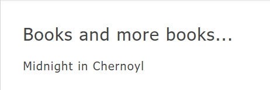
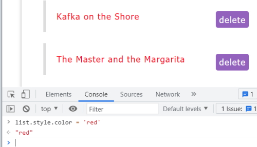

# JavaScript DOM Tutorial

## getElementById()

We can interrogate each element in the DOM by its ID. Each element must have a unique ID.

Type this into the console.

```
    document.getElementById('book-list');
```

Will return,

> &lt;div id=​"book-list"&gt;​&lt;h2 class=​"title"&gt;​Books to Read​&lt;/h2&gt;​&lt;ul&gt;​…​&lt;/ul&gt;​&lt;/div&gt;​

We could store this in a variable.

```
    let bookList = document.getElementById('book-list');
    console.log(bookList);
```

> &lt;div id=​&quot;book-list&quot;&gt;&lt;h2 class=​&quot;title&quot;&gt;​Books to Read&lt;/h2&gt;&lt;ul&gt;​&hellip;​&lt;/ul&gt;​&lt;/div&gt;​

## getElementsByClassName()

We can interrogate each element in the DOM by its class name.

In the case of class we can have multiple elements with the class name, for example.

```
    let titles = document.getElementsByClassName('title');
    console.log(titles);
```

Returns two titles.

> HTMLCollection(2) [h1.title, h2.title]

**Note:** This looks like an array but it isn't. It is actually a HTML Collection and if we click on the caret on the left hand side we can look at all of the objects in the collection and in our case there is two.

We can interrogate each element in the collection.

```
    let titles = document.getElementsByClassName('title');
    console.log(titles[0]);
```

> &lt;h1 class=&quot;title&quot;&gt;Bookorama&lt;/h1&gt;

## getElementsByTagName()

Interrogate elements by their tag.

```
    let lis = document.getElementsByTagName('li');
    console.log(lis);
```

Will bring back 4 list elements.

> HTMLCollection(4) [li, li, li, li]

We can get an element from the collection with,

```
    let lis = document.getElementsByTagName('li');
    console.log(lis[3]);
```

Returns the fourth element.

> &lt;li&gt;      
> 	&lt;span class=&quot;name&quot;&gt;The Master and the Margarita&lt;/span&gt;      
> 	&lt;span class=&quot;delete&quot;&gt;delete&lt;/span&gt;      
> &lt;/li&gt;

## Looping through elements

```
    let lis = document.getElementsByTagName('li');
    
    for (let i = 0; i < lis.length; i++) {
        const element = lis[i];
        console.log(element);
    }
```

Will show each element in the collection ``lis``.

A better way to do this.

```
    lis.forEach((item) => {
        console.log(item);
    });
```

This fails because item isn't an array.

We can prove this with:

```
    console.log(Array.isArray(titles));
```

Will return a **false** because *item* is a collection.

We could run this bit of code.

```
    console.log(Array.isArray(Array.from(lis)));
```

And this will produce a **true** because it turns *lis* into an array.

We can now run the code with:

```
    let lis = document.getElementsByTagName('li');

    Array.from(lis).forEach((item) => {
        console.log(item);
    });
```

This is better looking code that the **for()** version.

## The Query Selector

We can use the **querySelector()** to bring back all elements within an ID or class.

```
    let wrapper = document.querySelector('#wrapper');

    console.log(wrapper);
```

Will bring back all elements enclosed in the `div` with an ID of *wrapper*.

**Note:** This is just another way of bring elements from the DOM.

We can get a lot more specific than this with our query selector.

```
    let title = document.querySelector('#book-list li:nth-child(2) .name');

    console.log(title);
```

Returns:

> &lt;span class=&quot;name&quot;&gt;The Wise Man's Fear&lt;/span&gt;

What if we wanted to grab every span tag with a class of *name*?

```
    let books = document.querySelector('#book-list li .name');

    console.log(books);
```

Returns:

> &lt;span class=&quot;name&quot;&gt;Name of the Wind&lt;/span&gt;

It only returns the first book.

We need to make a minor change.

```
    let books = document.querySelectorAll('#book-list li .name');

    console.log(books);
```

`querySelecterAll()` will return a list of all books.

> NodeList(4) [span.name, span.name, span.name, span.name]

We can iterate through this list.

```
    let books = document.querySelectorAll('#book-list li .name');

    Array.from(books).forEach((item) => {
        console.log(item);
    });
```

Returns:

> &lt;span class=&quot;name&quot;&gt;Name of the Wind&lt;/span&gt;        
> &lt;span class=&quot;name&quot;&gt;The Wise Man's Fear&lt;/span&gt;     
> &lt;span class=&quot;name&quot;&gt;Kafka on the Shore&lt;/span&gt;      
> &lt;span class=&quot;name&quot;&gt;The Master and the Margarita&lt;/span&gt;

## Changing Text and HTML content

First we will look at changing the *text* content.

**Note:**

```
    let books = document.querySelectorAll('#book-list li .name');
```

Returns a node list, not a HTML collection. We don't have to convert a node list into an array to use the ``forEach()`` method. e.g.

```
    let books = document.querySelectorAll('#book-list li .name');

    books.forEach((item) => {
        console.log(item);
    });
```

Returns the same result as the previous example.

Now to return *text* we do the following.

```
    let books = document.querySelectorAll('#book-list li .name');

    books.forEach((book) => {
        console.log(book.textContent);
    });
```

Returns:

> Name of the Wind      
> The Wise Man's Fear       
> Kafka on the Shore        
> The Master and the Margarita

We can use this to change the text in the DOM.

```
    let books = document.querySelectorAll('#book-list li .name');

    books.forEach((book) => {
        book.textContent = `Title: ${book.textContent}`;
    });
```

On the web page we see.

> Title: Name of the Wind     
> Title: The Wise Man's Fear      
> Title: Kafka on the Shore       
> Title: The Master and the Margarita       

### Changing the HTML

This time we will just select the element with the ID of `book-list` and we want to see the HTML elements.

```
    const bookList = document.querySelector('#book-list');

    console.log(bookList.innerHTML);
```

Returns:

> &lt;h2 class=&quot;title&quot;&gt;Books to Read&lt;/h2&gt;      
> 	&lt;ul&gt;        
> 		&lt;li&gt;        
> 			&lt;span class=&quot;name&quot;&gt;Title: Name of the Wind&lt;/span&gt;       
> 			&lt;span class=&quot;delete&quot;&gt;delete&lt;/span&gt;      
> 		&lt;/li&gt;       
> 		&lt;li&gt;        
> 			&lt;span class=&quot;name&quot;&gt;Title: The Wise Man's Fear&lt;/span&gt;        
> 			&lt;span class=&quot;delete&quot;&gt;delete&lt;/span&gt;      
> 		&lt;/li&gt;       
> 		&lt;li&gt;        
> 			&lt;span class=&quot;name&quot;&gt;Title: Kafka on the Shore&lt;/span&gt;     
> 			&lt;span class=&quot;delete&quot;&gt;delete&lt;/span&gt;      
> 		&lt;/li&gt;       
> 		&lt;li&gt;        
> 			&lt;span class=&quot;name&quot;&gt;Title: The Master and the Margarita&lt;/span&gt;
> 			&lt;span class=&quot;delete&quot;&gt;delete&lt;/span&gt;      
> 		&lt;/li&gt;       
>  	&lt;/ul&gt;

To change the content we can do this.

```
    const bookList = document.querySelector('#book-list');

    bookList.innerHTML = '<h2>Books and more books...</h2>';
```

Changes the content to.


## Appending to HTML

It is simple to append more content.

```
    const bookList = document.querySelector('#book-list');

    bookList.innerHTML = '<h2>Books and more books...</h2>';
    bookList.innerHTML += '<p>Midnight in Chernoyl</p>';
```



## DOM nodes

All elements in the DOM are node types. You can find the node type with the following code.


```
    const banner = document.querySelector('#page-banner');

    console.log(`#page-banner nodeType is: ${banner.nodeType}`);
```

This returns the following but isn't that useful.

> #page-banner nodeType is: 1

If you have a look at this page it will provide more information.

https://www.w3schools.com/jsref/prop_node_nodetype.asp

**1** denotes that the node is an element.

Change the console log to:

```
    const banner = document.querySelector('#page-banner');

    console.log(`#page-banner node name is: ${banner.nodeName}`);
```

Returns:

> #page-banner nodeName is: DIV

This is more helpful.

We can also find out of the node has any child nodes.

```
    const banner = document.querySelector('#page-banner');

    console.log(`#page-banner node has child nodes: ${banner.hasChildNodes()}`);
```

Returns:

> #page-banner node has child nodes: true

## Cloning a Node

We can clone a node with the following code.

```
    const clonedBanner = banner.cloneNode(true);
    console.log(clonedBanner);
```

Returns:

> &lt;div id=&quot;page-banner&quot;&gt;        
>   &lt;h1 class=&quot;title&quot;&gt;Bookorama&lt;/h1&gt;        
>     &lt;p&gt;Books for Ninjas&lt;/p&gt;       
>     &lt;form id=&quot;search-books&quot;&gt;      
>       &lt;input type=&quot;text&quot; placeholder=&quot;Search books...&quot; /&gt;
>     &lt;/form&gt;       
> &lt;/div&gt;

Later on we will see how to add the cloned node to the web page.

## DOM Events and removing content

Event listeners can be added to anything on the DOM. For example we could add an event listener to a piece of text on the page and print a console message when that text is clicked.

First check that we can get to the piece of text.

```
    let h2 = document.querySelector('#book-list h2');
    console.log(h2);
```

There a couple of ``h2`` elements on the page so we have to target the ``h2`` that we are after and we can do this with **#book-list h2**. This says target the ``h2`` with in the ``div`` with an ID of *book-list*.

```
    console.log(h2.innerHTML);
```

Returns:

> Books to Read

Now that we are targeting the correct piece of text we can add an event listener.

Once again we can check we are getting the correct piece of text with.

```
    let h2 = document.querySelector('#book-list h2');

    h2.addEventListener('click', (e) => {
        console.log(e.target);
        console.log(e);
    });
```

**e** is the event parameter.

**target** is a property on the event object and it is going to tell us which element was clicked and in our case it was the piece of text.

We will also log the event object and this will return.

> \&lt;h2 class=&quot;title&quot;\&gt;Books to Read\&lt;/h2\&gt;      
> {isTrusted: true, pointerId: 1, width: 1, height: 1, pressure: 0, …}

The event object hold a large amount of information on what happened.

for example.

> clientX: 369      
> clientY: 240

Is the coordinates of the screen where the mouse button was pressed.

> shiftKey: false

Tells us that the shift key wasn't pressed when we clicked the mouse button.

We can also get this value and program against it.

```
    if (e.shiftKey === true) {
        // then do something
    }
```

Now we are going to put event listeners on all of the ``delete`` buttons. First we have to get the collection of ``delete`` buttons and turn them into an array. Then if someone clicks on a particular ``delete`` button we will remove that ``li`` element.

```
    let buttons = document.querySelectorAll('#book-list .delete');

    Array.from(buttons).forEach((button) => {
        button.addEventListener('click', (e) => {
            const li = e.target.parentElement;
            li.parentNode.removeChild(li);
        });
    });
```

*buttons* is the collection of delete buttons so we need to select all buttons.

Create a ``forEach()`` loop so that we can iterate thourh the buttons to find the ``delete`` button that was clicked on.

Add an event listener to each button. If the button was *clicked* then this is the ``li`` element we want to remove.

From here we want to select the parent element (the ``li``). We do this with.

```
    const li = e.target.parentElement;
```

Now we have to find the parent element of the ``li`` so that we can remove its child  (``li``).

```
    li.parentNode.removeChild(li);
```

This will remove the correct ``li``.

### Prevent default behaviour

We can also use an event listener to stop an event from happening. for example.

Add a ``href`` element to the DOM.

```
    <a href="https://www.google.com"></a>
```

Obviously when we click on this it will navigate to Google.com. What if we don't want this to happen? We want to prevent its default behaviour.

```
    const link = document.querySelector('#page-banner a');

    link.addEventListener('click', (e) => {
        e.preventDefault();

        console.log('Navigation to ', e.target.hostname, ' has been suspended.');
    });
```

We click on the link and stops the default behaviour and returns this message.

> Navigation to www.google.com has been suspended.

## Event bubbling

The previous code isn't the most efficient code we can use. At the moment it only has to check through 4 books to find the element to delete. Imagine if there were hundreds of books then it would be very time consuming.

This is where we could use event bubbling to improve the code.

```
    let list = document.querySelector('#book-list ul');

    list.addEventListener('click', (e) => {
        if (e.target.className === 'delete') {
            const li = e.target.parentElement;
            // li.parentNode.removeChild(li); // would work, but even better,
            list.removeChild(li);
        }
    });
```

In this case we add the list of books to list by selecting the ``ul`` tag as the parent tag. We then add an event listener to the ``ul`` tag. In the **if** statement we check to see if an element in the list has a class of *delete*  and was clicked. We bubble up to the ``li`` tag using the *e.target.parentElement* property. We the remove the list element using the *list.removeChild(li)* method.

### Interacting with forms

the first trick we can do with forms is run the following command in the console window.

```
    document.forms
```

In our case this will return two HTML forms collections, search-books and add-books.

> HTMLCollection(2) [form#search-books, form#add-book, search-books: form#search-books, add-book: form#add-book]

We can select one with.

```
    document.forms[0]
```

Or, a more preferable way.

```
    document.forms['add-book']
```

We now want to be able to add a new book into our book list. We can do this by grabbing the form.

```
    const addForm = document.forms['add-book'];

    addForm.addEventListener('submit', (e) => {
        e.preventDefault();

        const value = addForm.querySelector('input[type="text"]').value;
        console.log(value);
    });
```

Returns:

> My Brilliant Friend

Once we get the form value we can add a ``submit`` event listener to that form. We need to prevent the default page from refreshing with *e.preventDefault();*.

Now we need to get the text that is entered into the input form with.

```
    const value = addForm.querySelector('input[type="text"]').value;
```

We can log out the value entered into the input field from here. We are now ready to append an new ``li`` tag with the new book title.

## Creating elements

Final code for appending a new element to the DOM.

```
    // add book
    const addForm = document.forms['add-book'];

    addForm.addEventListener('submit', (e) => {
        e.preventDefault();

        const value = addForm.querySelector('input[type="text"]').value;

        // create elements
        const li = document.createElement('li');
        const bookName = document.createElement('span');
        const deleteButton = document.createElement('span');

        // add content
        deleteButton.textContent = 'delete';
        deleteButton.className = 'delete';
        bookName.textContent = value;
        bookName.className = 'name';

        // append to DOM
        li.appendChild(bookName);
        li.appendChild(deleteButton);
        list.appendChild(li);
    });
```

We need to create elements with ``document.createElement()``.

```
    const li = document.createElement('li');
    const bookName = document.createElement('span');
    const deleteButton = document.createElement('span');
```

Now we can add content and give that content class names for CSS styling.

```
    deleteButton.textContent = 'delete';
    deleteButton.className = 'delete';
    bookName.textContent = value;
    bookName.className = 'name';
```

Finally we need to append our elements to the DOM. First we append the elements to the ``li`` element and then we append this to the list variable that we created previously from the ``ul`` that we use for the book list.

```
    li.appendChild(bookName);
    li.appendChild(deleteButton);
    list.appendChild(li);
```

Now we can add a new book title.


## Changing styles and classes

We can add styles on the fly in the CSS.

Previously we had created a variable *list* from the query selector. We can then change styles.

```
    list.style.color = 'red';
```



In the last section we applied class names with the following code.

```
    deleteButton.className = 'delete';
    bookName.className = 'name';
```

There is a better way that will allow us to add multiple classes to one element.

```
    deleteButton.classList.add = 'delete';
    bookName.classList.add = 'name';
```

Now with this code we could add another class to an element.

```
    deleteButton.classList.add = 'delete';
    bookName.classList.add = 'name';
    bookName.classList.add = 'test';
```

> &lt;span class=&quot;name test&quot;&gt;The Master and the Margarita&lt;/span&gt;

We can remove classes with

We need to do one more thing before we are finished.

```
    bookName.classList.remove = 'test';
```

## Adding attributes

We are not going to use attributes in our code but it is good to be aware of them.

```
    // add classes
    deleteButton.classList.add('delete');
    bookName.classList.add('name');
    bookName.classList.add('test');

    // attributes
    console.log(bookName.getAttribute('class'));
```

Returns.

> name test

We can also set attributes.

```
    bookName.setAttribute('class', 'test2');
```

Returns.

> &lt;span class=&quot;test2&quot;&gt;The Master and the Margarita&lt;/span&gt;

**Note:** we could have added two classes if we had wanted to.

```
    bookName.setAttribute('class', 'test2 test3');
```

We can even do a check to see if an element has an attribute.

```
    console.log(bookName.hasAttribute('class'));
```

Returns.

> true

Once again we can also remove an attribute.

```
    bookName.hasAttribute('class');
```

Returns.

> &lt;span&gt;IQ84&lt;/span&gt;

## Checkbox and change events

As an example we want to add a checkbox to remove all of our books from the list and then when we uncheck the box we want to see our book list again.

First we will will add some HTML to the index page.

```
	<form id="add-book">
		<input type="checkbox" id="hide" />
		<label for="hide">Hide all books</label>
		<input type="text" placeholder="Add a book..." />
		<button>Add</button>
	</form>
```

Now some CSS.

```
    #add-book #hide {
        width: 30px;
    }

    #add-book label {
        line-height: 52px;
    }
```

When we check we want to hide the books, when we uncheck we want to see the books.

```
    // hide books
    const hideBox = document.querySelector('#hide');
    hideBox.addEventListener('change', (e) => {
        if (hideBox.checked) {
            list.style.display = 'none';
        } else {
            list.style.display = 'initial';
        }
    });
```

Checking displays.


## Creating a search filter

```
    // search books
    const searchBar = document.forms['search-books'].querySelector('input');
    searchBar.addEventListener('keyup', (e) => {
        const term = e.target.value.toLowerCase();
        const books = list.getElementsByTagName('li');
        Array.from(books).forEach((book) => {
            const title = book.firstElementChild.textContent;

            if (title.toLowerCase().indexOf(term) != -1) {
                book.style.display = 'block';
            } else {
                book.style.display = 'none';
            }
        });
    });
```

First we want grab the form with the ID *search-books* and select the input field.

We add an event listener to listen for keypresses in the input field.

Next we get a list of all books by their ``li`` tag.

We iterate through each book to see if they have the text that we are searching for.

We set the style to block if the title exists or none if the title doesn't exist.

## Creating tabbed content

This is the HTML code for our tabbed content.

```
    <div id="tabbed-content">
    	<ul class="tabs">
    	  <li data-target="#about" class="active">About</li>
    	  <li data-target="#contact">Contact</li>
    	</ul>
    	<div class="panel active" id="about">
    	  <p>Content for about tab...</p>
    	  <p>What we are about...</p>
    	</div>
    	<div class="panel" id="contact">
    	  <p>Content for contact tab...</p>
    	  <p>This is how to contact us...</p>
    	</div>
    </div>
```

Now we can manipulate the tabbed content to hide one tab while showing the other tabs content.

```
    // tabbed content
    const tabs = document.querySelector('.tabs');
    const panels = document.querySelectorAll('.panel');

    tabs.addEventListener('click', (e) => {
        if (e.target.tagName === 'LI') {
            const targetPanel = document.querySelector(e.target.dataset.target);
            Array.from(panels).forEach((panel) => {
                if (panel === targetPanel) {
                    panel.classList.add('active');
                } else {
                    panel.classList.remove('active');
                }
            });
        }
    });
```

When we open the page the *About* content is showing because the ``div`` is active.

```
    <div class="panel active" id="about">
```

We select the ``tabs`` element.

```
    <ul class="tabs">
      <li data-target="#about" class="active">About</li>
      <li data-target="#contact">Contact</li>
    </ul>
```

With the selector.

```
    const tabs = document.querySelector('.tabs');
```

We also select the panel class elements by.

```
    const panels = document.querySelectorAll('.panel');
```

We add an event listener to tell us when one of the ``date-target`` elements has been clicked. Frome here we can work out which ``li`` was selected so we can make that ``li`` element active and hide the other ``li`` element.

```
    if (e.target.tagName === 'LI') {
        const targetPanel = document.querySelector(e.target.dataset.target);
        Array.from(panels).forEach((panel) => {
            if (panel === targetPanel) {
                panel.classList.add('active');
            } else {
                panel.classList.remove('active');
            }
        });
    }
```

When the first page is opened the About tabbed content is showing because it is active.


When we click on the content tab.


### app.js final code

```
    // delete book
    const list = document.querySelector('#book-list ul');

    list.addEventListener('click', (e) => {
        if (e.target.className === 'delete') {
            const li = e.target.parentElement;
            // li.parentNode.removeChild(li); // would work, but even better,
            list.removeChild(li);
        }
    });

    // add book
    const addForm = document.forms['add-book'];

    addForm.addEventListener('submit', (e) => {
        e.preventDefault();

        let value = addForm.querySelector('input[type="text"]').value;

        // create elements
        const li = document.createElement('li');
        const bookName = document.createElement('span');
        const deleteButton = document.createElement('span');

        // add content
        deleteButton.textContent = 'delete';
        bookName.textContent = value;

        // add classes
        deleteButton.classList.add('delete');
        bookName.classList.add('name');
        bookName.classList.add('test');

        // attributes
        console.log(bookName.getAttribute('class'));
        bookName.setAttribute('class', 'test2');
        console.log(bookName.hasAttribute('class'));
        bookName.removeAttribute('class');

        // append to DOM
        li.appendChild(bookName);
        li.appendChild(deleteButton);
        list.appendChild(li);
        value.textContent = '';
    });

    // hide books
    const hideBox = document.querySelector('#hide');
    hideBox.addEventListener('change', (e) => {
        if (hideBox.checked) {
            list.style.display = 'none';
        } else {
            list.style.display = 'initial';
        }
    });

    // search books
    const searchBar = document.forms['search-books'].querySelector('input');
    searchBar.addEventListener('keyup', (e) => {
        const term = e.target.value.toLowerCase();
        const books = list.getElementsByTagName('li');
        Array.from(books).forEach((book) => {
            const title = book.firstElementChild.textContent;

            if (title.toLowerCase().indexOf(term) != -1) {
                book.style.display = 'block';
            } else {
                book.style.display = 'none';
            }
        });
    });

    // tabbed content
    const tabs = document.querySelector('.tabs');
    const panels = document.querySelectorAll('.panel');

    tabs.addEventListener('click', (e) => {
        if (e.target.tagName === 'LI') {
            const targetPanel = document.querySelector(e.target.dataset.target);
            Array.from(panels).forEach((panel) => {
                if (panel === targetPanel) {
                    panel.classList.add('active');
                } else {
                    panel.classList.remove('active');
                }
            });
        }
    });
```
